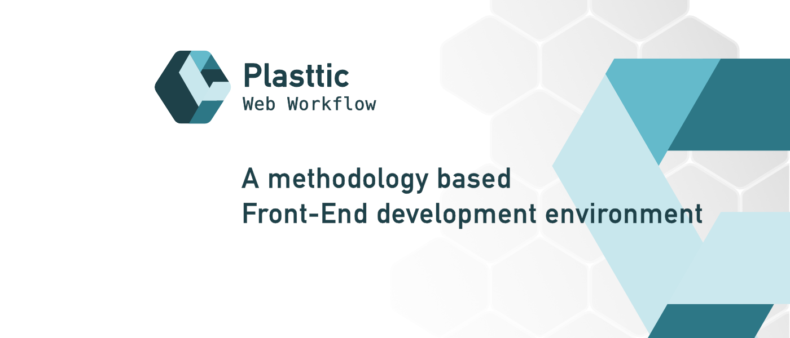

[](https://plasttic.dev)

# Plasttic Web Workflow

A methodology based Front-End development environment.

[](https://www.npmjs.com/package/plasttic)&ensp;&ensp;[](https://github.com/tojeiro-me/Plasttic/blob/master/LICENSE)&ensp;[](https://volta.net/tojeiro-me/Plasttic)&emsp;[](https://twitter.com/Plasttic_Dev)

---

## Index

- [Plasttic Web Workflow](#plasttic-web-workflow)
  - [Index](#index)
  - [About](#about)
    - [Related projects](#related-projects)
  - [Methodology](#methodology)
  - [Start](#start)
    - [Quick Start](#quick-start)
      - [Typescript](#typescript)
      - [Workflow](#workflow)
      - [Development](#development)
      - [Customizing](#customizing)
      - [Linting](#linting)
      - [Development with https](#development-with-https)
      - [Libraries](#libraries)
    - [Manual Install (Clone)](#manual-install-clone)
  - [Templates](#templates)
  - [Documentation](#documentation)
  - [Links](#links)
  - [Follow](#follow)
  - [License](#license)

---

## About

---

Plasttic Web Workflow is a methodology based professional Front-End development environment for Websites and Web Apps: HTML and CSS/PostCSS boilerplate, Atomic Design System, Typescript/Javascript, Dev/Build Scripts, File structure, Conventions & Best Practices.

This workflow is not intended to be a framework, but rather a starting point, allowing the developer to adopt or customize the methodology with the objective of producing accessible, scalable and robust interfaces.

_Note: The files installed are not empty. The reason is that, by creating a template, it's easier to demonstrate the methodology, concepts and conventions, and even building upon the existing code._

### Related projects

---

- [Plasttic CSS Reset](https://github.com/tojeiro-me/Plasttic-reset)

- [Plasttic HTML Boilerplate](https://github.com/tojeiro-me/Plasttic-boilerplate)

---

## Methodology

---

- Core Fundamentals
- Best Practices/Conventions
- Performance/Core Web Vitals
- Separation of Concerns
- Documentation
- Design System/Atomic Design
- BEM Methodology
- [CSS Reset](https://github.com/tojeiro-me/Plasttic-reset)
- [SEO/Social Media HTML Boilerplate](https://github.com/tojeiro-me/Plasttic-boilerplate)
- Semantic HTML/Accessibility
- CSS/Postcss
- Typescript/Javascript
- Code Conventions/Linting
- Debug/Test

## Start

---

### Quick Start

```
(cd into your projects folder)
npx create-plasttic
cd project-name
npm install
```

1. Creates a folder with the `project name` you defined
2. Downloads and installs the latest version of Plasttic Web Workflow
3. Installs all the project dependencies\*

#### Typescript

- Install Typescript globally `npm install -g typescript` \*although it is installed as a devDependency, the Dev Scripts may not work as expected if you do not install it globally also.
- [TS-Reset](https://github.com/total-typescript/ts-reset) is installed by default. If you wish to disable it, delete the `reset.d.ts` file.
- :warning: The ESLint VSCode extension isn't working with typescript files (Parsing error:). **<u>Typescript is still linted in the Dev scripts and Husky hooks</u>** and VSCode has builtin support for typescript validation. Suggestion: Use [Prettier ESLint](https://marketplace.visualstudio.com/items?itemName=rvest.vs-code-prettier-eslint&ssr=false) (requires some configuration: see [Plasttic VSCode settings](./.vscode/vscode.settings.json))

#### Workflow

- Custom Dev/Build Scripts, File/Folder Structure, [HTML Boilerplate](https://github.com/tojeiro-me/Plasttic-boilerplate/blob/master/index.html), [CSS Reset](https://github.com/tojeiro-me/Plasttic-reset), [Templates](https://boilerplate.plasttic.dev), [Atomic Design CSS](docs/atomic-design.md), [Print CSS](./src/assets/css/print.css), ES Modules, Typescript, PostCSS, CSS/JS Minification, Conventions, Linting, Image Optimization (Soon!), Testing (Soon!)

#### Development

- Run `npm run dev` to start the dev server on `http://localhost:8000` \*
- Run `npm run build` when you are ready to publish \*

- \*Source folder: `src/`, Dev folder: `dev/`, Build folder: `dist/`

#### Customizing

- Search for "TODO:" in comments, relative to info that needs to be changed or checked. After, change it to "DONE:". If using VS Code, use the [Todo Tree extension](https://marketplace.visualstudio.com/items?itemName=Gruntfuggly.todo-tree) or [TODO Highlight](https://marketplace.visualstudio.com/items?itemName=wayou.vscode-todo-highlight)
- If .##gitignore## exists, rename it to .gitignore and customize to your project info.
- _Note: The files installed are not empty. The reason is that, by creating a template, it's easier to demonstrate the methodology, concepts and conventions, and even building upon the existing code._

#### Linting

- Prettier
  - Plugin: [Prettier](https://marketplace.visualstudio.com/items?itemName=esbenp.prettier-vscode&ssr=false)
  - Files: html, css, js, ts, md, json
  - Usage: Plugin and Scripts
  - Result: Errors, Warnings and Fix
- ESLint
  - Plugin: [ESLint](https://marketplace.visualstudio.com/items?itemName=dbaeumer.vscode-eslint&ssr=false) + [Prettier ESLint](https://marketplace.visualstudio.com/items?itemName=rvest.vs-code-prettier-eslint&ssr=false)
  - Files: html, js, ts
  - Usage: Plugin and Scripts
  - Result: Errors, Warnings and Fix
- Stylelint
  - Plugin: [Stylelint](https://marketplace.visualstudio.com/items?itemName=stylelint.vscode-stylelint&ssr=false)
  - Files: css
  - Usage: Plugin only
  - Result: Warnings

#### Development with https

- Step 1: Run `mkdir certs`
- Step 2: Run `cd certs`
- Step 3: Install certificate with [mkcert](https://mkcert.dev/)
- Step 4: Check certificate filenames and/or path in the file `browser-sync.cjs`
- Step 5: Run `npm run dev:ssl` to start the dev server on `https://localhost:8000`

#### Libraries

- [TS-Reset](https://github.com/total-typescript/ts-reset#example) (If you wish to disable it, delete the `reset.d.ts` file.)
- [Zod](https://github.com/colinhacks/zod#installation)

---

### Manual Install (Clone)

- Step 1: Copy the repository `git clone https://github.com/tojeiro-me/Plasttic.git`
  (The project files are inside the `package`folder)
- Step 2: Move the the contents of the `package` folder into your `project-folder`
- Step 3: Run `cd project-folder-name`
- Step 4: Rename `.##gitignore##` to `.gitignore`
- Step 5: Run `npm install` to install the needed dependencies
- Step 6: Run `npm run dev` to start the dev server on `http://localhost:8000` \*
- Step 7: Run `npm run build` when you are ready to publish \*

- \*Source folder: `src/`, Dev folder: `dev/`, Build folder: `dist/`

## Templates

---

- [Under Construction](https://boilerplate.plasttic.dev/temporary.html)
- [404 Error Page](https://boilerplate.plasttic.dev/404.html)
- Single Page (Soon!)

## Documentation

---

- File Comments
- Check [docs](./docs/) folder :construction:
- Documentation website (Soon!)

_Please check the [CHANGELOG](/CHANGELOG.md) for major or breaking changes_

## Links

---

- [Website](https://plasttic.dev) :construction:
- Documentation (Soon!)

## Follow

---

[](https://twitter.com/Plasttic_Dev)&emsp;[](https://mastodon.social/@plasttic)&emsp;[](https://github.com/tojeiro-me)

---

## License

---

- [MIT](./LICENSE)

---

[](https://github.com/tojeiro-me/Plasttic)
